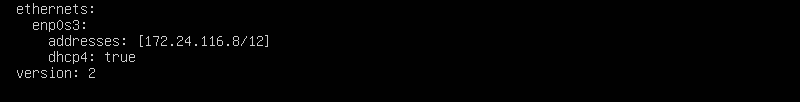
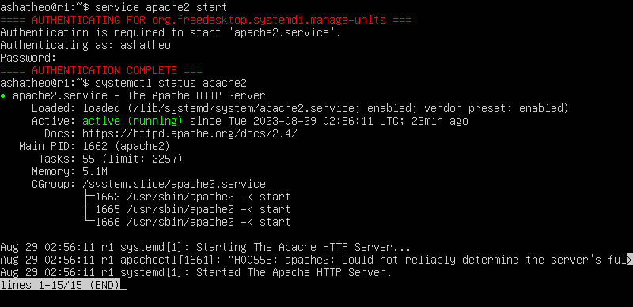
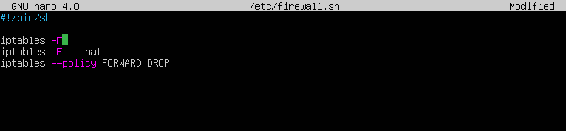

# Linux Network

Linux networks configuration on virtual machines.
```
888                           d8888          888               888    888                        
888                          d88888          888               888    888                        
888                         d88P888          888               888    888                        
88888b.  888  888          d88P 888 .d8888b  88888b.   8888b.  888888 88888b.   .d88b.   .d88b.  
888 "88b 888  888         d88P  888 88K      888 "88b     "88b 888    888 "88b d8P  Y8b d88""88b 
888  888 888  888        d88P   888 "Y8888b. 888  888 .d888888 888    888  888 88888888 888  888 
888 d88P Y88b 888       d8888888888      X88 888  888 888  888 Y88b.  888  888 Y8b.     Y88..88P 
88888P"   "Y88888      d88P     888  88888P' 888  888 "Y888888  "Y888 888  888  "Y8888   "Y88P"  
              888                                                                                
         Y8b d88P                                                                                
          "Y88P"                                                                                 
```

## Содержание

1. [Инструмент ipcalc](#part-1-инструмент-ipcalc)
2. [Статическая маршрутизация между двумя машинами](#part-2-статическая-маршрутизация-между-двумя-машинами)
3. [Утилита iperf3](#part-3-утилита-iperf3)
4. [Сетевой экран](#part-4-сетевой-экран)
5. [Статическая маршрутизация сети](#part-5-статическая-маршрутизация-сети)
6. [Динамическая настройка IP с помощью DHCP](#part-6-динамическая-настройка-ip-с-помощью-dhcp)
7. [NAT](#part-7-nat)
8. [Допополнительно. Знакомство с SSH Tunnels](#part-8-дополнительно-знакомство-с-ssh-tunnels)

<br>

## Part 1. Инструмент **ipcalc**
`-` Итак, начнём наше погружение в удивительный мир сетей со знакомства с IP адресами. А использовать для этого мы будем инструмент **ipcalc**.

<br>

**== Задание ==**

##### Поднять виртуальную машину (далее -- ws1)

#### 1.1. Сети и маски
##### Определить и записать в отчёт:
##### 1) адрес сети *192.167.38.54/13*
##### 2) перевод маски *255.255.255.0* в префиксную и двоичную запись, */15* в обычную и двоичную, *11111111.11111111.11111111.11110000* в обычную и префиксную
##### 3) минимальный и максимальный хост в сети *12.167.38.4* при масках: */8*, *11111111.11111111.00000000.00000000*, *255.255.254.0* и */4*

<br>


**== Выполнение ==**
<br>

#### 1.1 Подымаем виртуальную машину (ws1) и с помощью команды  `sudo apt install ipcalc`  устанавливаем ipcalc и с помощью команды  `ipcalc 192.167.38.54/13` определяем адрес сети для *192.167.38.54/13*

<br>*Получаем Адрес сети: *192.167.38.54*<br>

#### 1.2.1 Для перевода маски 255.255.255.0 в префиксную и двоичную запись используем команду  `ipcalc 255.255.255.0`

* префиксная форма записи */24* 
* двоичная форма записи *11111111.11111111.11111111.00000000*

#### 1.2.2. Для перевода маски /15 в обычную и двоичную запись используем команду  `ipcalc /15`

* обычная форма записи *255.254.0.0*
* двоичная *11111111.11111110.00000000.00000000*

#### 1.2.3. Для перевода маски 11111111.11111111.11111111.11110000 в обычную и префиксную запись используем команду `ipcalc /11111111.11111111.11111111.11110000`

* обычная форма записи *255.255.255.240*
* префиксная */28*

#### 1.3.1. Используем команду  `ipcalc 12.167.38.4/8` чтобы определить минимальный и максимальный хост в сети *12.167.38.4* при маске: */8*

* Минимальный хост - 12.0.0.1

* Максимальный хост - 12.255.255.254

### 1.3.2. Используем команду  `ipcalc 12.167.38.4/16` чтобы определить минимальный и максимальный хост в сети *12.167.38.4* при маске: *11111111.11111111.00000000.00000000* (мы не можем указать двоичную форму адреса в качестве ввода ipcalc, поэтому используем маску /16)

* Минимальный хост - 12.167.0.1

* Максимальный хост - 12.167.255.254

### 1.3.3. Используем команду  `ipcalc 12.167.38.4/255.255.254.0` чтобы определить минимальный и максимальный хост в сети *12.167.38.4* при маске: *255.255.254.0*

* Минимальный хост - 12.167.38.1

* Максимальный хост - 12.167.39.254

### 1.3.4. Используем команду  `ipcalc 12.167.38.4/4` чтобы определить минимальный и максимальный хост в сети *12.167.38.4* при маске: */4*

* Минимальный хост - 0.0.0.1
* Максимальный хост - 15.255.255.254

<br>

**== Задание ==**

#### 1.2. localhost
##### Определить и записать в отчёт, можно ли обратиться к приложению, работающему на localhost, со следующими IP: *194.34.23.100*, *127.0.0.2*, *127.1.0.1*, *128.0.0.1*

<br>

**== Выполнение ==**

#### 1. Воспользуемся командой `ipcalc` указав IP-адреса, которые вы хотите проверить (Если IP-адрес расположен в диапазоне 127.0.0.0/8 (127.0.0.1 - 127.255.255.255), то это часть локальной сети localhost)

* Можно обратиться к приложению, работающему на localhost, с IP: *127.0.0.2*, *127.1.0.1*
* И следовательно, нельзя обратиться к приложению, работающему на localhost, с IP: *194.34.23.100*, *128.0.0.1*

<br>

**== Задание ==**

#### 1.3. Диапазоны и сегменты сетей
##### Определить и записать в отчёт:
##### 1) какие из перечисленных IP можно использовать в качестве публичного, а какие только в качестве частных: *10.0.0.45*, *134.43.0.2*, *192.168.4.2*, *172.20.250.4*, *172.0.2.1*, *192.172.0.1*, *172.68.0.2*, *172.16.255.255*, *10.10.10.10*, *192.169.168.1*
##### 2) какие из перечисленных IP адресов шлюза возможны у сети *10.10.0.0/18*: *10.0.0.1*, *10.10.0.2*, *10.10.10.10*, *10.10.100.1*, *10.10.1.255*

<br>

**== Выполнение ==**

#### 1. Воспользуемся командой `ipcalc` указав IP-адреса, которые вы хотите проверить, у приватных адресов в графе Host/Net будет указано Private Internet

<br>*Пример приватного IP адреса*<br>

<br>

* Публичные: *134.43.0.2*, *172.0.2.1*, *192.172.0.1*, *192.169.168.1*

* Частные: *10.0.0.45*, *10.10.10.10*, *192.168.4.2*, *172.20.250.4*, *172.68.0.2*, *172.16.255.255*

#### 1. Воспользуемся командой `ipcalc 10.10.0.0/18` и обратим внимание на диапазон доступных шлюзов HostMin HostMax

<br>*Диапазон доступных шлюзов*<br>

<br>

* Из перечисленных IP адресов шлюза возможны у сети 10.10.0.0/18: *10.10.0.2*, *10.10.10.10*, *10.10.100.1*, *10.10.1.255*

<br>

## Part 2. Статическая маршрутизация между двумя машинами


**== Задание ==**

##### Поднять две виртуальные машины (далее -- ws1 и ws2)

##### С помощью команды `ip a` посмотреть существующие сетевые интерфейсы
- В отчёт поместить скрин с вызовом и выводом использованной команды.
##### Описать сетевой интерфейс, соответствующий внутренней сети, на обеих машинах и задать следующие адреса и маски: ws1 - *192.168.100.10*, маска */16*, ws2 - *172.24.116.8*, маска */12*
- В отчёт поместить скрины с содержанием изменённого файла *etc/netplan/00-installer-config.yaml* для каждой машины.
##### Выполнить команду `netplan apply` для перезапуска сервиса сети
- В отчёт поместить скрин с вызовом и выводом использованной команды.

<br>

**== Выполнение ==**

#### 1. Подымаем виртуальные машины ws1 и ws2 и с помощью команды `ip a` смотрим существующие сетевые интерфейсы

<br>*сетевые интерфейсы ws1*<br>
<br>*сетевые интерфейсы ws2*<br>
<br>

#### 2. В настройках Virtual Box  во вкладке Сеть задаем Тип подключения: Внутренняя сеть на каждой виртуальной машине

<br>*Подключаем внутреннюю сеть между ws1 и ws2*<br>
<br>

#### 3. Командой  ` sudo nano /etc/netplan/00-installer-config.yaml ` редактируev файл и задаем адрес и маску на ws1 и ws 2
<br>*00-installer-config.yaml ws1*<br>
<br>*00-installer-config.yaml ws2*<br>
<br>

#### 4. Командой ` sudo netplan apply ` перезапускаем сеть. При успешном выполнение вывод в терминале будет пустым, при наличие ошибок в файле 00-installer-config.yaml вывод после команды сообщит нам об этом

<br>*успешный вывод при выполнении sudo netplan apply *<br>
<br>

**== Задание ==**

#### 2.1. Добавление статического маршрута вручную
##### Добавить статический маршрут от одной машины до другой и обратно при помощи команды вида `ip r add`
##### Пропинговать соединение между машинами
- В отчёт поместить скрин с вызовом и выводом использованных команд.

<br>

**== Выполнение ==**

#### 1. Добавляем статический маршрут вручную от ws1 до ws2 при помощи команды вида `sudo ip r add 172.24.116.8 dev enp0s3` 

#### 2. Добавляем статический маршрут вручную от ws2 до ws1 при помощи команды вида `sudo ip r add 192.168.100.10 dev enp0s3`

#### 3. При помощи команды  `ping -c 7 172.24.116.8` c ws1 пингуем 7 раз ws2

#### 4. При помощи команды  `ping -c 7 192.168.100.10` c ws2 пингуем 7 раз ws1

<br>*Маршрут от ws1 до ws2 *<br>
<br>*Маршрут от ws2 до ws1 *<br>

<br>

**== Задание ==**

#### 2.2. Добавление статического маршрута с сохранением
##### Перезапустить машины
##### Добавить статический маршрут от одной машины до другой с помощью файла *etc/netplan/00-installer-config.yaml*
- В отчёт поместить скрин с содержанием изменённого файла *etc/netplan/00-installer-config.yaml*.
##### Пропинговать соединение между машинами
- В отчёт поместить скрин с вызовом и выводом использованной команды.

<br>

**== Выполнение ==**

#### 1. Перезапускаем машины, все наши назначения из пункта 2.1 не сохранились. Добавим статический маршрут от одной машины до другой, отредактируя файл etc/netplan/00-installer-config.yaml при помощи команды ` sudo nano /etc/netplan/00-installer-config.yaml ` Дополнительно прописываем порт для доступа в интернет

<br>*Измененный .yaml на ws1 *<br>

<br>*Измененный .yaml на ws2 *<br>

#### 2. Командой ` sudo netplan apply ` перезапускаем сеть и при помощи команды `ping <ip>` пингуем машины между собой

<br>*Пингуем на ws1 *<br>
<br>*Пингуем на ws2 *<br>

<br>

## Part 3. Утилита **iperf3**

**== Задание ==**

*В данном задании используются виртуальные машины ws1 и ws2 из Части 2*

#### 3.1. Скорость соединения
##### Перевести и записать в отчёт: 8 Mbps в MB/s, 100 MB/s в Kbps, 1 Gbps в Mbps

**== Выполнение ==**

* 8 Мегабит в секунду = 1 Мегабайт в секунду
* 100 Мегабайт в секунду = 800000 Килобит в секунду
* 1 Гигабит в секунду = 1000 Мегабит в секунду


<br>

**== Задание ==**

#### 3.2. Утилита **iperf3**
##### Измерить скорость соединения между ws1 и ws2
- В отчёт поместить скрины с вызовом и выводом использованных команд.

**== Выполнение ==**

#### 1. Устанавливаем утилиту `iperf3` командой `sudo apt install iperf3` на обе машины.

#### 2. На ws1 запускаем iperf3 в режиме сервера: `iperf3 -s`
<br>*Вывод команды `iperf3 -s` *<br>

#### 2. На ws2 запускаем iperf3 с указанием IP сервера к которому подключаемся `iperf3 -c 192.168.100.10`

<br>*`-с` — адрес сервера с запущенным iperf3 на 5201 порту
*<br>
* Получаем скорость около 2.92 Gbits/sec

<br>

## Part 4. Сетевой экран

**== Задание ==**

*В данном задании используются виртуальные машины ws1 и ws2 из Части 2*

#### 4.1. Утилита **iptables**
##### Создать файл */etc/firewall.sh*, имитирующий фаерволл, на ws1 и ws2:
```shell
#!/bin/sh

# Удаление всех правил в таблице "filter" (по-умолчанию).
iptables –F
iptables -X
```
##### Нужно добавить в файл подряд следующие правила:
##### 1) на ws1 применить стратегию когда в начале пишется запрещающее правило, а в конце пишется разрешающее правило (это касается пунктов 4 и 5)
##### 2) на ws2 применить стратегию когда в начале пишется разрешающее правило, а в конце пишется запрещающее правило (это касается пунктов 4 и 5)
##### 3) открыть на машинах доступ для порта 22 (ssh) и порта 80 (http)
##### 4) запретить *echo reply* (машина не должна "пинговаться”, т.е. должна быть блокировка на OUTPUT)
##### 5) разрешить *echo reply* (машина должна "пинговаться")
- В отчёт поместить скрины с содержанием файла */etc/firewall* для каждой машины.
##### Запустить файлы на обеих машинах командами `chmod +x /etc/firewall.sh` и `/etc/firewall.sh`
- В отчёт поместить скрины с запуском обоих файлов.
- В отчёте описать разницу между стратегиями, применёнными в первом и втором файлах.

<br>

**== Выполнение ==**

#### 1. В корневом каталоге ws1 командой `sudo nano /etc/firewall.sh` создаем файл имитирующий фаерволл и добавляем в него правила 

<br>*firewall.sh на ws1*<br>

#### 2. В корневом каталоге ws2 командой `sudo nano /etc/firewall.sh` создаем файл имитирующий фаерволл и добавляем в него правила 

<br>*firewall.sh на ws2*<br>


#### 3. Запусткаеим файлы на обеих машинах командами `chmod +x /etc/firewall.sh` и `/etc/firewall.sh`

<br>*`chmod +x /etc/firewall.sh` и `/etc/firewall.sh` на ws1*<br>
<br>*`chmod +x /etc/firewall.sh` и `/etc/firewall.sh` на ws2*<br>

* Разница между стратегиями, применёнными в первом и втором файлах: На первой машине первым указано запрещающее правило на выход, поэтому она не сможет пропинговать другую машину. У второй машины, наоброт - первым указано разрешающее правило, значит она сможет пропинговать другую машину.

<br>


**== Задание ==**
#### 4.2. Утилита **nmap**
##### Командой **ping** найти машину, которая не "пингуется", после чего утилитой **nmap** показать, что хост машины запущен
*Проверка: в выводе nmap должно быть сказано: `Host is up`*
- В отчёт поместить скрины с вызовом и выводом использованных команд **ping** и **nmap**.

##### Сохранить дампы образов виртуальных машин
**p.s. Ни в коем случае не сохранять дампы в гит!**

<br>

**== Выполнение ==**

#### 1. Пингуем машины между собой при помощи команды `ping <IP-address>`

<br>*с ws1 на ws2 пингуется*<br>
<br>*с ws2 на ws1 не пингуется*<br>

<br>

#### 2. Устанавливаем утилиту nmap командой `sudo apt install nmap` и запускаем ее на ws1 и ws2 командой `sudo nmap <IP-address>`

<br>*Host is up ws1*<br>
<br>*Host is up ws2*<br>

<br>

* Делаем снимок состояния виртуальной машины в виртуал бокс  ` Снимок` -> ` Сделать` 

<br>

## Part 5. Статическая маршрутизация сети

`-` Пока что мы соединяли всего две машины, но теперь пришло время для статической маршрутизации целой сети.

**== Задание ==**

Сеть: \


##### Поднять пять виртуальных машин (3 рабочие станции (ws11, ws21, ws22) и 2 роутера (r1, r2))

#### 5.1. Настройка адресов машин
##### Настроить конфигурации машин в *etc/netplan/00-installer-config.yaml* согласно сети на рисунке.
- В отчёт поместить скрины с содержанием файла *etc/netplan/00-installer-config.yaml* для каждой машины.
##### Перезапустить сервис сети. Если ошибок нет, то командой `ip -4 a` проверить, что адрес машины задан верно. Также пропинговать ws22 с ws21. Аналогично пропинговать r1 с ws11.
- В отчёт поместить скрины с вызовом и выводом использованных команд.

<br>

**== Выполнение ==**

#### 1. Подымаем пять виртуальных машин и Командой  ` sudo vim /etc/netplan/00-installer-config.yaml ` настраиваем конфигурацию машин согласно схеме 

<br>*Настройки ws11*<br>
<br>*Настройки ws21*<br>
<br>*Настройки ws22*<br>
<br>*Настройки r1*<br>
<br>*Настройки r2*<br>

<br>

#### 2. Перезапускаем сервис сети  ` sudo netpan apply ` Проверяем командой `ip -4 a` , что адреса машин задан верно

<br>* ip -4 a ws11*<br>
<br>* ip -4 a ws21*<br>
<br>* ip -4 a ws22*<br>
<br>* ip -4 a r1*<br>
<br>* ip -4 a r2*<br>

<br>

#### 3. Пропингуем ws22 с ws21 и пропингуем r1 с ws11

<br>*Пингуем ws22 с ws21*<br>
<br>*Пингуем r1 с ws11*<br>

<br>

**== Задание ==**

#### 5.2. Включение переадресации IP-адресов.
##### Для включения переадресации IP, выполните команду на роутерах:
`sysctl -w net.ipv4.ip_forward=1`
*При таком подходе переадресация не будет работать после перезагрузки системы.*
- В отчёт поместить скрин с вызовом и выводом использованной команды.
##### Откройте файл */etc/sysctl.conf* и добавьте в него следующую строку:
`net.ipv4.ip_forward = 1`
*При использовании этого подхода, IP-переадресация включена на постоянной основе.*
- В отчёт поместить скрин с содержанием изменённого файла */etc/sysctl.conf*.

<br>

**== Выполнение ==**

#### 1. Выполняем команду  ` sudo sysctl -w net.ipv4.ip_forward=1 ` на роутерах r1 и r2 при таком подходе переадресация не будет работать после перезагрузки системы.

<br>*Пингуем ws22 с ws21*<br>
<br>*Пингуем r1 с ws11*<br>

#### 2. Откроем файл ` sudo nano /etc/sysctl.conf ` и добавляем `net.ipv4.ip_forward = 1`

<br>*/etc/sysctl.conf r1*<br>
<br>*/etc/sysctl.conf r2*<br>

<br>

**== Задание ==**

#### 5.3. Установка маршрута по-умолчанию
Пример вывода команды `ip r` после добавления шлюза:
```
default via 10.10.0.1 dev eth0
10.10.0.0/18 dev eth0 proto kernel scope link src 10.10.0.2
```
##### Настроить маршрут по-умолчанию (шлюз) для рабочих станций. Для этого добавить `default` перед IP роутера в файле конфигураций
- В отчёт поместить скрин с содержанием файла *etc/netplan/00-installer-config.yaml*.
##### Вызвать `ip r` и показать, что добавился маршрут в таблицу маршрутизации
- В отчёт поместить скрин с вызовом и выводом использованной команды.
##### Пропинговать с ws11 роутер r2 и показать на r2, что пинг доходит. Для этого использовать команду:
`tcpdump -tn -i eth1`
- В отчёт поместить скрин с вызовом и выводом использованных команд.

<br>

**== Выполнение ==**

#### 1. Выполняем команду  ` sudo nano /etc/netplan/00-installer-config.yaml ` чтобы добавить маршрут по-умолчанию в файле конфигураций

<br>*00-installer-config.yaml ws11*<br>
<br>*00-installer-config.yaml ws21*<br>
<br>*00-installer-config.yaml ws22*<br>

#### 2. Выполняем команду  ` ip r ` чтобы удостовериться в добавлении маршрута

<br>*ip r ws11*<br>
<br>*ip r ws21*<br>
<br>*ip r ws22*<br>

#### 3. Пингуем с ws11 роутер r2  ` ping 10.100.0.12 `

<br>*пинг не проходит, потомучто роутер пакеты получает, а куда вернуть не знает*<br>

#### 4. При помощи команды на  r2  ` tcpdump -tn -i enp0s8 ` Запускаем  утилиту tcpdump, она позволяет прослушать порты и вывести на экран информацию с каких IP адресов приходят пакеты. В данном случае слушаем интерфейс enp0s8

<br>*Запускаем пинг на ws11 еще раз и видем, что пакеиы доходят до r2*<br>

<br>

**== Задание ==**

#### 5.4. Добавление статических маршрутов
##### Добавить в роутеры r1 и r2 статические маршруты в файле конфигураций. Пример для r1 маршрута в сетку 10.20.0.0/26:
```shell
# Добавить в конец описания сетевого интерфейса eth1:
- to: 10.20.0.0
  via: 10.100.0.12
```
- В отчёт поместить скрины с содержанием изменённого файла *etc/netplan/00-installer-config.yaml* для каждого роутера.
##### Вызвать `ip r` и показать таблицы с маршрутами на обоих роутерах. Пример таблицы на r1:
```
10.100.0.0/16 dev eth1 proto kernel scope link src 10.100.0.11
10.20.0.0/26 via 10.100.0.12 dev eth1
10.10.0.0/18 dev eth0 proto kernel scope link src 10.10.0.1
```
- В отчёт поместить скрин с вызовом и выводом использованной команды.
##### Запустить команды на ws11:
`ip r list 10.10.0.0/[маска сети]` и `ip r list 0.0.0.0/0`
- В отчёт поместить скрин с вызовом и выводом использованных команд.
- В отчёте объяснить, почему для адреса 10.10.0.0/\[маска сети\] был выбран маршрут, отличный от 0.0.0.0/0, хотя он попадает под маршрут по-умолчанию.

<br>

**== Выполнение ==**

#### 1. Выполняем команду  ` sudo nano /etc/netplan/00-installer-config.yaml ` чтобы добавить маршрут по-умолчанию в файле конфигураций на r1 и r2 и применяем данные изменения

<br>*файл конфигураций r1*<br>
<br>*файл конфигураций r2*<br>

<br>

#### 2. Выполняем команду  ` ip r ` проверяем настройки на роутерах

<br>*ip r на r1*<br>
<br>*ip r на r2*<br>

<br>

#### 3. Запускаем на ws11 команды   `ip r list 10.10.0.0/18` и `ip r list 0.0.0.0/0` `
<br>*вывод команд ws11*<br>

*Для адреса 10.10.0.0/18 был выбран маршрут, отличный от 0.0.0.0/0 (он попадает под маршрут по-умолчанию),  машина ws11 соединена с сетью 10.10.0.0/18 по своему IP-адресу 10.10.0.2, для других адресов используется маршрут по умолчанию, который указан в файле 10.10.0.1.

<br>

**== Задание ==**

#### 5.5. Построение списка маршрутизаторов
Пример вывода утилиты **traceroute** после добавления шлюза:
```
1 10.10.0.1 0 ms 1 ms 0 ms
2 10.100.0.12 1 ms 0 ms 1 ms
3 10.20.0.10 12 ms 1 ms 3 ms
```
##### Запустить на r1 команду дампа:
`tcpdump -tnv -i eth0`
##### При помощи утилиты **traceroute** построить список маршрутизаторов на пути от ws11 до ws21
- В отчёт поместить скрины с вызовом и выводом использованных команд (tcpdump и traceroute).
- В отчёте, опираясь на вывод, полученный из дампа на r1, объяснить принцип работы построения пути при помощи **traceroute**.

<br>

**== Выполнение ==**

#### 1. На ws11 установим traceroute с помощью команды  ` sudo apt install traceroute `

#### 2. Запустим на r1 команду дампа  ` tcpdump -tnv -i enp0s8 ` на ws11 запустить команду ` traceroute 10.20.0.10 ` 

<br>*tcpdump -tnv -i enp0s8 на r1*<br>
<br>*traceroute 10.20.0.10 на ws11*<br>

<br>

* Каждый пакет проходит на своем пути определенное количество узлов, пока достигнет своей цели. Причем, каждый пакет имеет свое время жизни. Это количество узлов, которые может пройти пакет перед тем, как он будет уничтожен. Этот параметр записывается в заголовке TTL, каждый маршрутизатор, через который будет проходить пакет уменьшает его на единицу. При TTL=0 пакет уничтожается, а отправителю отсылается сообщение Time Exceeded.

* Команда traceroute linux использует UDP пакеты. Она отправляет пакет с TTL=1 и смотрит адрес ответившего узла, дальше TTL=2, TTL=3 и так пока не достигнет цели. Каждый раз отправляется по три пакета и для каждого из них измеряется время прохождения. Пакет отправляется на случайный порт, который, скорее всего, не занят. Когда утилита traceroute получает сообщение от целевого узла о том, что порт недоступен трассировка считается завершенной.

<br>

#### 5.6. Использование протокола **ICMP** при маршрутизации
##### Запустить на r1 перехват сетевого трафика, проходящего через eth0 с помощью команды:
`tcpdump -n -i eth0 icmp`
##### Пропинговать с ws11 несуществующий IP (например, *10.30.0.111*) с помощью команды:
`ping -c 1 10.30.0.111`
- В отчёт поместить скрин с вызовом и выводом использованных команд.

##### Сохранить дампы образов виртуальных машин
**p.s. Ни в коем случае не сохранять дампы в гит!**

<br>

**== Выполнение ==**

#### 1. Запустим на r1 перехват сетевого трафика, проходящего через enp0s8 с помощью команды  ` sudo tcpdump -n -i enp0s8 icmp `

<br>*sudo tcpdump -n -i enp0s8 icmp на r1*<br>

#### 2. Пропингуем с ws11 несуществующий IP (например, 10.30.111.123) с помощью команды ` ping -c 1 10.30.111.123 `

<br>*sudo tcpdump -n -i enp0s8 icmp на r1*<br>

<br>

* Сохраняем дампы образов виртуальных машин

<br>

## Part 6. Динамическая настройка IP с помощью **DHCP**


**== Задание ==**

*В данном задании используются виртуальные машины из Части 5*

##### Для r2 настроить в файле */etc/dhcp/dhcpd.conf* конфигурацию службы **DHCP**:
##### 1) указать адрес маршрутизатора по-умолчанию, DNS-сервер и адрес внутренней сети. Пример файла для r2:
```shell
subnet 10.100.0.0 netmask 255.255.0.0 {}

subnet 10.20.0.0 netmask 255.255.255.192
{
    range 10.20.0.2 10.20.0.50;
    option routers 10.20.0.1;
    option domain-name-servers 10.20.0.1;
}
```
##### 2) в файле *resolv.conf* прописать `nameserver 8.8.8.8.`
- В отчёт поместить скрины с содержанием изменённых файлов.
##### Перезагрузить службу **DHCP** командой `systemctl restart isc-dhcp-server`. Машину ws21 перезагрузить при помощи `reboot` и через `ip a` показать, что она получила адрес. Также пропинговать ws22 с ws21.
- В отчёт поместить скрины с вызовом и выводом использованных команд.

<br>

**== Выполнение ==**

#### 1. На r2 установим dhcp-server с помощью команды  ` sudo apt-get install isc-dhcp-server ` и открываем файл /etc/dhcp/dhcpd.conf для редактирования с помощью команды  ` sudo nano /etc/dhcp/dhcpd.conf ` и вносим изменения

<br>*измененный dhcpd.conf на r2*<br>

<br>

#### 2. На r2 открываем файл /etc/dhcp/dhcpd.conf для редактирования с помощью команды  ` sudo nano /etc/resolv.conf ` и пропишем `nameserver 8.8.8.8.`

<br>*измененный resolv.conf на r2*<br>

<br>

#### 3. Перед выполнением следующих пунктов, нам нужно отредактировать /etc/netplan/00-installer-config.yaml  для включения службы dhcp на ws21 и ws22 `sudo nano /etc/netplan/00-installer-config.yaml` и принять изменения `sudo netplan apply`

<br>*.yaml  dhcp true*<br>

<br>

#### 4. Перезагружаем службу **DHCP** командой `systemctl restart isc-dhcp-server`

<br>*Вызов и вывод команды перезагрущки dhcp*<br>

#### 5. Машину ws21 перезагружаем при помощи `reboot` и через команду `ip a` проверяем, что она получила адрес. Через команду `ip a` проверяем ip аддрес ws22, чтобы пропинговать ws22 с ws21 с помощью команды `ping 10.20.0.4`

<br>*Вызов и вывод команды ip a на ws21*<br>

<br>*Вызов и вывод команды ip a на ws22*<br>

<br>*Вызов и вывод команды ping*<br>

<br>

**== Задание ==**

##### Указать MAC адрес у ws11, для этого в *etc/netplan/00-installer-config.yaml* надо добавить строки: `macaddress: 10:10:10:10:10:BA`, `dhcp4: true`
- В отчёт поместить скрин с содержанием изменённого файла *etc/netplan/00-installer-config.yaml*.

<br>

**== Выполнение ==**

#### 1. Чтобы указать MAC-адрес у ws11, при помощи `sudo nano /etc/netplan/00-installer-config.yaml` добавляем строки добавить строки: `macaddress: 10:10:10:10:10:BA`, `dhcp4: true` и принимаем изменения `sudo netplan apply`

<br>*измененный etc/netplan/00-installer-config.yaml на ws11*<br>

<br>

**== Задание ==**

##### Для r1 настроить аналогично r2, но сделать выдачу адресов с жесткой привязкой к MAC-адресу (ws11). Провести аналогичные тесты
- В отчёте этот пункт описать аналогично настройке для r2.

<br>

**== Выполнение ==**

#### 1. Настроим r1 аналогично r2, но выдачу адресов сделаем с жесткой привязкой к MAC-адресу (ws11). На r1 установим dhcp-server с помощью команды  ` sudo apt-get install isc-dhcp-server ` и открываем файл /etc/dhcp/dhcpd.conf для редактирования с помощью команды  ` sudo nano /etc/dhcp/dhcpd.conf ` и вносим изменения

<br>*измененный dhcpd.conf на r2*<br>

<br>

#### 2. На r1 открываем файл /etc/dhcp/dhcpd.conf для редактирования с помощью команды  ` sudo nano /etc/resolv.conf ` и пропишем `nameserver 8.8.8.8.`

<br>*измененный resolv.conf на r1*<br>

<br>

#### 3. Перезагружаем службу **DHCP** командой `systemctl restart isc-dhcp-server`

<br>*Вызов и вывод команды перезагрущки dhcp*<br>

#### 4. Машину ws11 перезагружаем при помощи `reboot` и через команду `ip a` проверяем, что она получила адрес. Пингуем ws22 с ws11 с помощью команды `ping 10.10.0.4`

<br>*Вызов и вывод команды ip a на ws21*<br>

<br>*Вызов и вывод команды ping*<br>

<br>

**== Задание ==**

##### Запросить с ws21 обновление ip адреса
- В отчёте поместить скрины ip до и после обновления.
- В отчёте описать, какими опциями **DHCP** сервера пользовались в данном пункте.

##### Сохранить дампы образов виртуальных машин
**p.s. Ни в коем случае не сохранять дампы в гит!**

<br>

**== Выполнение ==**

#### 1. На ws21 запрашиваем ip при помощи команды  ` ip a ` 

<br>*ip a на ws21*<br>

<br>

#### 2. Для удаления старого ip адреса используем команду  ` sudo dhclient -r `, для получения нового ip адреса используем команду ` sudo dhclient ` и для проверки нового ip используем команду ` ip a `
<br>*измененный ip на ws21*<br>

<br>

 В отчёте описать, какими опциями **DHCP** сервера пользовались в данном пункте.:
* Настройка конфигурации службы DHCP (адрес маршрутизатора по-умолчанию, DNS-сервер, адрес внутренней сети, привязка к MAC-адресу)
* Клиент протокола динамической конфигурации хоста (команда dhclient) для обновления или освобождения IP-адреса

## Part 7. **NAT**

**== Задание ==**

*В данном задании используются виртуальные машины из Части 5*
##### В файле */etc/apache2/ports.conf* на ws22 и r1 изменить строку `Listen 80` на `Listen 0.0.0.0:80`, то есть сделать сервер Apache2 общедоступным
- В отчёт поместить скрин с содержанием изменённого файла.
##### Запустить веб-сервер Apache командой `service apache2 start` на ws22 и r1
- В отчёт поместить скрины с вызовом и выводом использованной команды.

<br>

**== Выполнение ==**

#### 1. Установим apache2 командой  ` sudo apt install apache2 `, В файле /etc/apache2/ports.conf на ws22 и r1 меняем настроки при помощи команды `sudo nano /etc/apache2/ports.conf`

<br>*измененный /etc/apache2/ports.conf*<br>

#### 2. Запустим apache2 командой  ` service apache2 start ` на ws22 и r1. И проверим состояние сервера комнадой `systemctl status apache2 `

<br>*Запуск и состояние apache2 на ws22*<br>
<br>*Запуск и состояние apache2 на r1*<br>

<br>

**== Задание ==**

##### Добавить в фаервол, созданный по аналогии с фаерволом из Части 4, на r2 следующие правила:
##### 1) удаление правил в таблице filter - `iptables -F`
##### 2) удаление правил в таблице "NAT" - `iptables -F -t nat`
##### 3) отбрасывать все маршрутизируемые пакеты - `iptables --policy FORWARD DROP`
##### Запускать файл также, как в Части 4
##### Проверить соединение между ws22 и r1 командой `ping`
*При запуске файла с этими правилами, ws22 не должна "пинговаться" с r1*
- В отчёт поместить скрины с вызовом и выводом использованной команды.

<br>

**== Выполнение ==**

#### 1. В корневом каталоге r2 командой `sudo nano /etc/firewall.sh` создаем файл имитирующий фаерволл и добавляем в него правила 

<br>*firewall.sh на r2*<br>


#### 2. Запускаeм файлы на обеих машинах командами `chmod +x /etc/firewall.sh` и `sudo bash /etc/firewall.sh` и пингуем ws22 и r1 командой ping

<br>*firewall.sh на r2*<br>
<br>*ping ws22 на r1*<br>
<br>*ping r1 на ws22*<br>

<br>

**== Задание ==**

##### Добавить в файл ещё одно правило:
##### 4) разрешить маршрутизацию всех пакетов протокола **ICMP**
##### Запускать файл также, как в Части 4
##### Проверить соединение между ws22 и r1 командой `ping`
*При запуске файла с этими правилами, ws22 должна "пинговаться" с r1*
- В отчёт поместить скрины с вызовом и выводом использованной команды.

<br>

**== Выполнение ==**

#### 1. На r2 командой `sudo nano /etc/firewall.sh` изменяем правила для фаервола

<br>*firewall.sh на r2*<br>

#### 2. Запускаeм файлы на обеих машинах командами `chmod +x /etc/firewall.sh` и `sudo bash /etc/firewall.sh` и проверяем что ws22 пингуется с  r1 командой.

<br>*ping ws22 на r1*<br>

<br>

**== Задание ==**

##### Добавить в файл ещё два правила:
##### 5) включить **SNAT**, а именно маскирование всех локальных ip из локальной сети, находящейся за r2 (по обозначениям из Части 5 - сеть 10.20.0.0)
*Совет: стоит подумать о маршрутизации внутренних пакетов, а также внешних пакетов с установленным соединением*
##### 6) включить **DNAT** на 8080 порт машины r2 и добавить к веб-серверу Apache, запущенному на ws22, доступ извне сети
*Совет: стоит учесть, что при попытке подключения возникнет новое tcp-соединение, предназначенное ws22 и 80 порту*
- В отчёт поместить скрин с содержанием изменённого файла.
##### Запускать файл также, как в Части 4
*Перед тестированием рекомендуется отключить сетевой интерфейс **NAT** (его наличие можно проверить командой `ip a`) в VirtualBox, если он включен*
##### Проверить соединение по TCP для **SNAT**, для этого с ws22 подключиться к серверу Apache на r1 командой:
`telnet [адрес] [порт]`
##### Проверить соединение по TCP для **DNAT**, для этого с r1 подключиться к серверу Apache на ws22 командой `telnet` (обращаться по адресу r2 и порту 8080)
- В отчёт поместить скрины с вызовом и выводом использованных команд.

##### Сохранить дампы образов виртуальных машин
**p.s. Ни в коем случае не сохранять дампы в гит!**

<br>

**== Выполнение ==**

#### 1. Отключаем сетевой интерфейс NAT и на r2 командой `sudo nano /etc/firewall.sh` изменяем правила для фаервола и запускаем файл командами `sudo chmod +x /etc/firewall.sh` и `sudo bash /etc/firewall.sh`

<br>*firewall.sh на r2*<br>

#### 2. Проверяем соединение по TCP для SNAT, для этого с ws22 подключаемся к серверу Apache на r1 командой: `telnet 10.10.0.1 80`

<br>*ws22*<br>

#### 3. Проверяем соединение по TCP для DNAT, для этого с r1 подключаемся к серверу Apache на ws22 командой `telnet 10.20.0.20 80`

<br>*r1*<br>

<br>

## Part 8. Дополнительно. Знакомство с **SSH Tunnels**

**== Задание ==**

*В данном задании используются виртуальные машины из Части 5*

##### Запустить на r2 фаервол с правилами из Части 7
##### Запустить веб-сервер **Apache** на ws22 только на localhost (то есть в файле */etc/apache2/ports.conf* изменить строку `Listen 80` на `Listen localhost:80`)
##### Воспользоваться *Local TCP forwarding* с ws21 до ws22, чтобы получить доступ к веб-серверу на ws22 с ws21
##### Воспользоваться *Remote TCP forwarding* c ws11 до ws22, чтобы получить доступ к веб-серверу на ws22 с ws11
##### Для проверки, сработало ли подключение в обоих предыдущих пунктах, перейдите во второй терминал (например, клавишами Alt + F2) и выполните команду:
`telnet 127.0.0.1 [локальный порт]`
- В отчёте описать команды, необходимые для выполнения этих четырёх пунктов, а также приложить скриншоты с их вызовом и выводом.

##### Сохранить дампы образов виртуальных машин
**p.s. Ни в коем случае не сохранять дампы в гит!**


<br>

**== Выполнение ==**

#### 1. На r2 командой `sudo nano /etc/firewall.sh` изменяем правила для фаервола и запускаем файл командами `sudo chmod +x /etc/firewall.sh` и `sudo bash /etc/firewall.sh`

<br>*firewall.sh на r2*<br>


#### 2. В файле /etc/apache2/ports.conf на ws22 меняем настроки при помощи команды `sudo nano /etc/apache2/ports.conf`

<br>*ports.conf на ws22*<br>

#### 3. При помощи команды `ssh -L 8080:localhost:80 10.20.0.20` на ws21 устанавливаем соединение с сервером ws22 от машины ws21

<br>*Подключились по ssh к ws22 с машины ws21*<br>

* * если на машинах не установле openssh то его можно установить командой `sudo apt-get install openssh-server`

#### 4. При помощи команды `telnet 127.0.0.1 8080` проверяем сработало ли подключение

<br>*telnet 127.0.0.1 8080*<br>

#### 5. Теперь подключимся c ws11 до ws22 `ssh -R 8080:localhost:80 10.20.0.20`

<br>*подключились с ws11 к ws22*<br>
